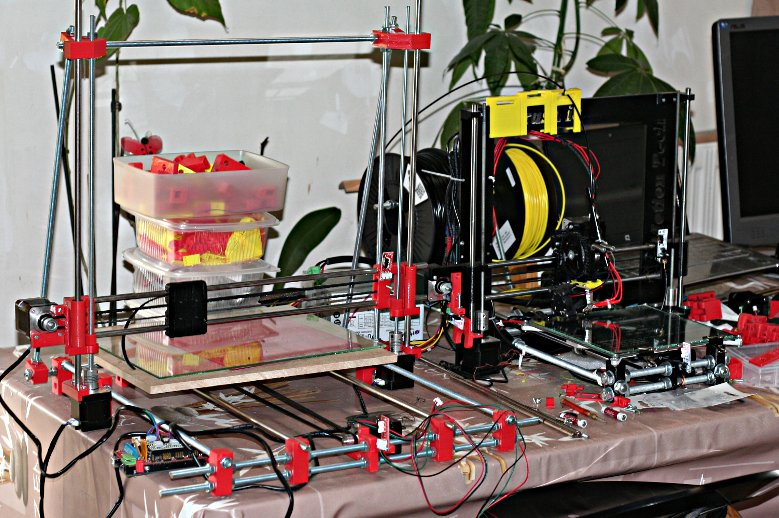

prusa-i3-rework-xxl
===================

Dérivation de l'imprimante 3D PRUSA i3 Rework en version agrandie à base de tige filetée uniquement

Ayant effectué le montage d'une imprimante 3D PRUSA i3 Rework pour un copain, je me suis dit que la mienne je la voudrais extensible en taille le plus facilement possible.

Sur cette image vous pouvez voir la prusa i3 Rework en noire et la nouvelle qui fait l'objet de ce dépôt github, les tiges filetées sont des tiges de 1m coupées en deux soit 50cms ce qui donne un volume d'impression possible de 300x250x250 mm  

Pour cela le cadre rigide de la PRUSA i3 Rework est remplacé par une structure faite uniquement de tiges filetés. Ces tiges sont généralement vendue au metre dans les magasins de bricolage. 

Les pièces necessaires à l'assemblage des tiges filetés ont été remodelées entiérement sous Freecad, vous trouverez donc dans ce dépôt tous les sources vous permettant ainsi toutes les modifications que vous souhaitez. 

Par ailleurs j'ai profité du peu d'expèrience que j'ai eu avec cette première imprimante pour y appliquer deux améliorations principales trouvées sur le net (voir les crédits)

Amélioration par rapport à la prusa i3 rework :

- les trois axes X, Y et Z peuvent être agrandis à volonté;
- amélioration de la transmission du mouvement pour l'axe Z
- amélioration de la tête d'impression (permet en changeant un minimum de pièce de passer du filament 3mm a 1,75 par exemple)
- mise en place de l'autolevel (pas encore fait). 

Explications détaillées et interactivitées:
===========================================
Billet principal sur mon blog <http://blog.passion-tarn-et-garonne.info/index.php/post/Imprimante-3D-Prusa-3i-Rework-XXL>

Crédits :
=========

 
Forum utilisateur Freecad et plus particulièrement Normandc

Thingiverse.com <http://www.thingiverse.com/> et plus particulièrement lucascorato pour:
- Anti backslash Z;
- "universal" extruder.

Liens :
=========
Logiciel Freecad <http://www.freecadweb.org> 
Emotion-Tech pour son kit Prusa i3 Rework <http://www.emotion-tech.com/> 
Forum reprap.org pour l'aide et le partage des tous ses membres <http://forums.reprap.org/list.php?110> 

Listes des pièces :
===================

<table>
<tr><td>Nom pièce</td><td>Illustration</td></tr>
<tr>
<td>Vue d'ensemble du chassis					</td>
<td></td>
</tr>
<tr>
<td>01-Pillier-Coin-x4					</td>
<td></td>
</tr>
<tr>
<td>02-Pillier-Milieu-Gauche			</td>
<td></td>
</tr>
<tr>
<td>03-Pillier-Milieu-Droit				</td>
<td></td>
</tr>
<tr><td>04-Pillier-Haut-Gauche-et-Droit-x2	</td>
<td></td></tr>
<tr><td>05-Hauban-Liaison-Mobile-x4			</td>
<td></td></tr>
<tr><td>06-Y-Pillier-x4						</td>
<td></td></tr>
<tr><td>07-Y-Moteur							</td>
<td></td></tr>
<tr><td>08-Y-Tendeur						</td>
<td></td></tr>
<tr><td>09-Y-Plateau-Attache-Courroie-x2	</td>
<td></td></tr>
<tr><td>10-Y-Bride-Plateau-x4				</td>
<td></td></tr>
<tr><td>11-Y-Bride-Plateau-Bride-x4			</td>
<td></td></tr>	
<tr><td>12-X-End-Moteur						</td>
<td></td></tr>
<tr><td>13-X-Chariot						</td>
<td></td></tr>
<tr><td>14-X-End-Tendeur					</td>
<td></td></tr>
<tr><td>15-Anti-Backslash-Z-x2					</td>
<td></td></tr>	
</table>

<table>
<tr><td>Vue ensemble Extrudeur						</td>
<td></td></tr>
<tr><td>16-Extrudeur						</td>
<td></td></tr>
<tr><td>17-Extrudeur-Adaptateur-Tete		</td>
<td></td></tr>
<tr><td>18-Extrudeur-Axe-verrouillage		</td>
<td></td></tr>
<tr><td>19-Extrudeur-Levier-verrouillage	</td>
<td></td></tr>
<tr><td>20-Extrudeur-Piece-3mm				</td>
<td></td></tr>
<tr><td>21-Extrudeur-Ventilo-Bas			</td>
<td></td></tr>
<tr><td>22-Extrudeur-Ventilo-Haut			</td>
<td></td></tr>
<tr><td>23-Extrudeur-verrouilleur			</td>
<td></td></tr>
</table>

